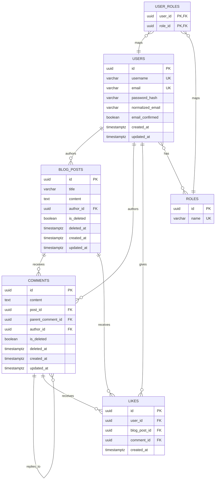

# ZBlogAPI

**zblog** is a RESTful blog API built on **ASP.NET Core (.NET 10)** and **PostgreSQL**, offering user registration and authentication via **JWT with refresh token rotation**, role-based authorization (Member, Author, Admin), and full support for posts, nested comments, and likes — powered by **EF Core (Npgsql)**, **ASP.NET Core Identity**, **Serilog**, and **Swagger**, and built to showcase REST API best practices.

---

## Features

- **Authentication & Authorization** — JWT access tokens with refresh token rotation & SHA-256 hashing, ASP.NET Core Identity with role-based access control (`Member`, `Author`, `Admin`)
- **Blog Posts** — full CRUD with soft delete and ownership checks
- **Nested Comments** — arbitrary-depth threaded replies on posts and other comments
- **Likes** — like/unlike posts or comments, with strict duplicate-like prevention
- **Soft Deletion** — posts and comments are soft-deleted for auditability and recoverability
- **Self-Documenting API** — Swagger/OpenAPI available at `/swagger`

## Non-Goals (v1)

- Rich text/media pipeline for post content
- Real-time notifications (likes/comments)
- Multi-tenant support

---

## Tech Stack

| Layer | Technology |
|---|---|
| Framework | ASP.NET Core Web API (.NET 8) |
| ORM | Entity Framework Core (`Npgsql` provider) |
| Database | PostgreSQL |
| Auth | ASP.NET Core Identity (role-based) |
| Docs | Swagger / OpenAPI |

---

## Database Schema

### Entity-Relationship Diagram



---

## Target Users

- **Readers/Members** — registered users who read, comment, and like content
- **Authors** — users authorized to create and manage their own blog posts, gets role by applying to become a writer button from dashboard.
- **Admins/Moderators** — role-based users who can manage any content (moderation, takedowns)

---

## Getting Started

### Prerequisites

- [.NET 10 SDK](https://dotnet.microsoft.com/download)
- PostgreSQL 14+

### Setup

```bash
# Clone the repo
git clone <repo-url>
cd zblog

# Restore dependencies
dotnet restore

# Update connection string in appsettings.json
# "ConnectionStrings:DefaultConnection": "Host=localhost;Database=zblog;Username=postgres;Password=yourpassword"

# Apply EF Core migrations
dotnet ef database update

# (Optional) Seed test data
psql -U postgres -d zblog -f Database/seed.sql

# Run the API
dotnet run
```

> Roles (`admin`, `author`, `member`) are seeded automatically at startup via `IdentityRoleSeeder`.

Once running, Swagger UI is available at:

```
https://localhost:<port>/swagger
```

---

## API Reference

### Auth

| Method | Endpoint | Description | Auth |
|---|:---|:---|---|
| POST | `/api/auth/register` | Register a new user (returns access + refresh tokens) | Public |
| POST | `/api/auth/login` | Authenticate a user, issue access + refresh tokens | Public |
| POST | `/api/auth/refresh` | Exchange a refresh token for a new access token (rotation) | Public |
| POST | `/api/auth/logout` | Revoke the given refresh token (session-based logout) | Authenticated |
| POST | `/api/auth/revoke` | Revoke a specific refresh token directly | Authenticated |

- Passwords are hashed, never stored in plaintext.
- Email and username must be unique.
- Roles (`Member`, `Author`, `Admin`) are assigned at registration or via admin promotion.
- `POST /api/auth/register` returns an access token + refresh token immediately — no second login needed.
- Refresh tokens are **single-use**: each refresh rotates the token (old one revoked, new one issued).
- Refresh tokens are **SHA-256 hashed** before storage — the raw token is never persisted.

### Blog Posts

| Method | Endpoint | Description | Auth | Responses |
|---|---|---|---|---|
| GET | `/api/blogpost` | List all blog posts (excludes soft-deleted) | Member+ | `200` list, `401`, `403` |
| GET | `/api/blogpost/{id}` | Get a single blog post with nested comments | Public | `200` detail, `404` |
| POST | `/api/blogpost` | Create a new blog post | Author+ | `201` detail, `401`, `403` |
| PUT | `/api/blogpost/{id}` | Update a blog post (owner or admin only) | Author+ | `200` detail, `401`, `403`, `404` |
| DELETE | `/api/blogpost/{id}` | Soft-delete a blog post (owner or admin only) | Author+ | `204`, `401`, `403`, `404` |

**Authorization flow:**
- `Member+` = any authenticated user with `member`, `author`, or `admin` role
- `Author+` = any authenticated user with `author` or `admin` role
- Ownership is enforced in the service layer: the requesting user must match `post.author_id` or have the `admin` role

**Response DTOs:**

```
BlogPostListResponseDto  —  GET  /api/blogpost
{
  id, title, content, createdAt, updatedAt,
  authorId, authorUsername, authorEmail, authorRole[],
  commentsCount, likesCount
}

BlogPostDetailResponseDto  —  GET  /api/blogpost/{id}
{
  id, title, content, isDeleted, createdAt, updatedAt,
  authorId, authorUsername, authorEmail, authorRole[],
  commentsCount, likesCount,
  comments: [ { id, content, authorId, authorUsername, createdAt, replies[] } ]
}

CreateBlogPostRequestDto  —  POST  /api/blogpost
{ title, content }

UpdateBlogPostRequestDto  —  PUT  /api/blogpost/{id}
{ title, content }
```

- Only the post's author or an admin may update/delete it.
- Soft-deleted posts are excluded from all queries (`is_deleted = false`).
- Each post tracks `created_at` and `updated_at`.
- Comments are returned as a nested tree (arbitrary depth via `parent_comment_id`).
- Author roles are included in both list and detail responses.

### Comments

| Method | Endpoint | Description | Auth | Responses |
|---|---|---|---|---|
| GET | `/api/comments?postId={id}` | List all comments for a post (excludes soft-deleted) | Public | `200` list, `400` |
| GET | `/api/comments/{id}` | Get a single comment with nested replies | Public | `200` detail, `404` |
| POST | `/api/comments` | Create a comment on a post or another comment | Member+ | `201` detail, `400`, `401`, `403` |
| PUT | `/api/comments/{id}` | Update a comment (owner or admin only) | Member+ | `200` detail, `401`, `403`, `404` |
| DELETE | `/api/comments/{id}` | Soft-delete a comment (owner or admin only) | Member+ | `204`, `401`, `403`, `404` |

- A comment belongs to exactly one blog post (directly or via its parent chain).
- A comment may optionally have a `parent_comment_id`, enabling arbitrary-depth nested replies.
- Soft-deleting a parent comment does not delete its children — children remain visible with a "[deleted]" placeholder for the parent.

### Likes

| Method | Endpoint | Description | Auth | Responses |
|---|---|---|---|---|
| POST | `/api/likes` | Like a blog post or a comment | Member+ | `201` detail, `400`, `401`, `403` |
| DELETE | `/api/likes` | Unlike a blog post or a comment | Member+ | `204`, `400`, `401`, `403` |

- A like target must be exactly one of: a blog post, or a comment.
- A user may like a given post/comment at most once (enforced via a unique constraint).
- Unliking hard-deletes the like record (likes carry no historical value).

---

## Authorization Model

| Role | Permissions |
|---|---|
| Member | Register, log in, comment, like/unlike |
| Author | All Member permissions + create/update/soft-delete own posts |
| Admin | All permissions on all content (moderation) |

---

## Non-Functional Requirements

- **Data Integrity** — foreign keys enforced at the database level; unique constraints on likes and auth fields.
- **Auditability** — `created_at` / `updated_at` on all major entities; soft-delete flags (`is_deleted`, `deleted_at`) on posts and comments.
- **Documentation** — Swagger/OpenAPI at `/swagger`.

---

## Roadmap

| Milestone | Scope |
|---|---|
| M1 | Core schema + migrations on PostgreSQL, Identity wiring, register/login/logout |
| M2 | Blog post CRUD + soft delete + Swagger docs |
| M3 | Nested comments CRUD + soft delete |
| M4 | Likes (posts + comments) with constraint enforcement |
| M5 | Role-based authorization hardening + tests |
