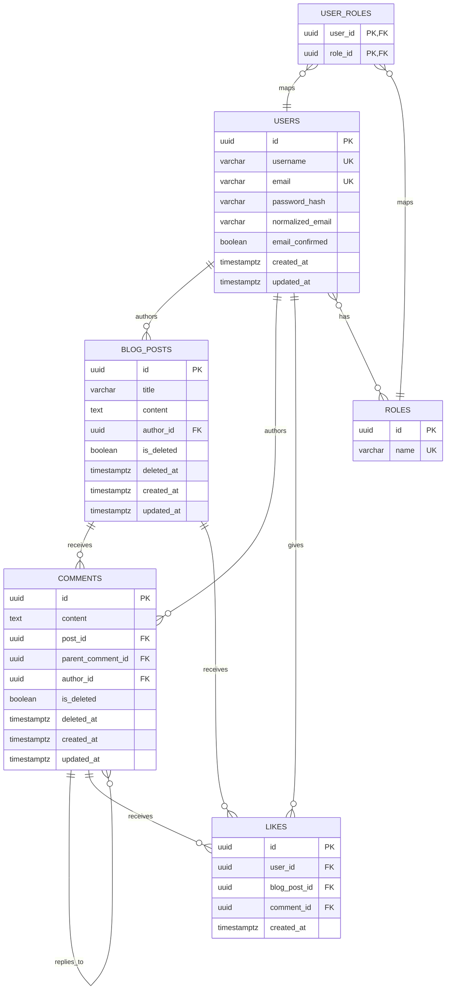

# Product Requirements Document (PRD): BlogAPI

| Field | Value |
|---|---|
| Document Owner | Ziad El-Sayed |
| Status | Draft |
| Version | 1.0 |
| Last Updated | 2026-07-05 |
| Source Reference | BlogAPI README (denizciMert/BlogAPI) |

---

## 1. Overview

BlogAPI is a RESTful backend service that allows users to register, authenticate, publish blog posts, comment (including nested replies), and like posts or comments. This PRD re-scopes the original .NET 8 / EF Core / SQL Server / ASP.NET Identity implementation onto a **PostgreSQL** data layer, and defines the functional and non-functional requirements needed to build or re-platform the system.

## 2. Goals

- Provide a secure, role-based blogging platform exposed via REST endpoints.
- Support hierarchical (nested) commenting on both posts and other comments.
- Support liking of posts and comments with strict duplicate-like prevention.
- Preserve content via soft deletion rather than hard deletion, for auditability and recoverability.
- Keep the API self-documenting via Swagger/OpenAPI.

### Non-Goals

- Rich text/media pipeline for post content (out of scope for v1).
- Real-time notifications (likes/comments) — may be a future phase.
- Multi-tenant support.

## 3. Target Users

- **Readers/Members** — registered users who read, comment, and like content.
- **Authors** — users authorized to create and manage their own blog posts.
- **Admins/Moderators** — role-based users who can manage any content (moderation, takedowns).

## 4. Functional Requirements

### 4.1 Account Management

| Method | Endpoint | Description | Auth |
|---|---|---|---|
| POST | `/api/account/register` | Register a new user | Public |
| POST | `/api/account/login` | Authenticate a user, issue session/token | Public |
| POST | `/api/account/logout` | Terminate the current session | Authenticated |

**Requirements:**
- Passwords must be hashed (never stored in plaintext).
- Email and username must be unique.
- Role assignment (e.g., `Member`, `Author`, `Admin`) occurs at registration or via admin promotion.

### 4.2 Blog Posts

| Method | Endpoint | Description | Auth |
|---|---|---|---|
| GET | `/api/blogpost` | List all blog posts (excludes soft-deleted) | Public |
| GET | `/api/blogpost/{id}` | Get a single blog post | Public |
| POST | `/api/blogpost` | Create a new blog post | Authorized |
| PUT | `/api/blogpost/{id}` | Update a blog post (owner or Admin) | Authorized |
| DELETE | `/api/blogpost/{id}` | Soft delete a blog post (owner or Admin) | Authorized |

**Requirements:**
- Only the post's author or a user with the `Admin` role may update/delete a post.
- Soft-deleted posts are excluded from all public list/detail queries.
- Each post tracks `created_at` and `updated_at` timestamps.

### 4.3 Comments

| Method | Endpoint | Description | Auth |
|---|---|---|---|
| GET | `/api/comments` | List all comments (excludes soft-deleted) | Public |
| GET | `/api/comments/{id}` | Get a single comment | Public |
| POST | `/api/comments` | Create a comment on a post or another comment | Authorized |
| PUT | `/api/comments/{id}` | Update a comment (owner or Admin) | Authorized |
| DELETE | `/api/comments/{id}` | Soft delete a comment (owner or Admin) | Authorized |

**Requirements:**
- A comment must belong to exactly one blog post (directly or via its parent chain).
- A comment may optionally have a `parent_comment_id`, enabling arbitrary-depth nested replies.
- Soft-deleting a parent comment should not delete its children; children remain visible with a "deleted" placeholder for the parent (recommended behavior — to confirm with stakeholders).

### 4.4 Likes

| Method | Endpoint | Description | Auth |
|---|---|---|---|
| POST | `/api/likes` | Like a blog post or a comment | Authorized |
| DELETE | `/api/likes` | Unlike a blog post or a comment | Authorized |

**Requirements:**
- A like target must be exactly one of: a blog post, or a comment (not both, not neither).
- A given user may like a given post/comment at most once (enforced via a unique constraint).
- Unliking removes the like record entirely (hard delete is acceptable here, since likes carry no historical value).

## 5. Non-Functional Requirements

- **Database:** PostgreSQL (replacing SQL Server in the original implementation).
- **Framework:** ASP.NET Core Web API (.NET 8), Entity Framework Core with the `Npgsql` provider.
- **Auth:** ASP.NET Core Identity, backed by PostgreSQL, using role-based authorization.
- **Documentation:** Swagger/OpenAPI available at a discoverable route (e.g., `/swagger`).
- **Data Integrity:** Foreign keys enforced at the database level; unique constraints for likes and account fields.
- **Auditability:** `created_at` / `updated_at` on all major entities; soft-delete flags (`is_deleted`, `deleted_at`) on posts and comments.

## 6. Database Schema (PostgreSQL)

### 6.1 Entity-Relationship Diagram



### 6.2 Table Definitions (DDL sketch)

```sql
-- Users
CREATE TABLE users (
    id                UUID PRIMARY KEY DEFAULT gen_random_uuid(),
    username          VARCHAR(64)  NOT NULL UNIQUE,
    email             VARCHAR(256) NOT NULL UNIQUE,
    normalized_email  VARCHAR(256) NOT NULL,
    password_hash     VARCHAR(512) NOT NULL,
    email_confirmed   BOOLEAN NOT NULL DEFAULT FALSE,
    created_at        TIMESTAMPTZ NOT NULL DEFAULT now(),
    updated_at        TIMESTAMPTZ NOT NULL DEFAULT now()
);

-- Roles
CREATE TABLE roles (
    id    UUID PRIMARY KEY DEFAULT gen_random_uuid(),
    name  VARCHAR(64) NOT NULL UNIQUE  -- e.g. 'Member', 'Author', 'Admin'
);

-- User <-> Role (many-to-many)
CREATE TABLE user_roles (
    user_id  UUID NOT NULL REFERENCES users(id) ON DELETE CASCADE,
    role_id  UUID NOT NULL REFERENCES roles(id) ON DELETE CASCADE,
    PRIMARY KEY (user_id, role_id)
);

-- Blog Posts
CREATE TABLE blog_posts (
    id          UUID PRIMARY KEY DEFAULT gen_random_uuid(),
    title       VARCHAR(256) NOT NULL,
    content     TEXT NOT NULL,
    author_id   UUID NOT NULL REFERENCES users(id) ON DELETE RESTRICT,
    is_deleted  BOOLEAN NOT NULL DEFAULT FALSE,
    deleted_at  TIMESTAMPTZ,
    created_at  TIMESTAMPTZ NOT NULL DEFAULT now(),
    updated_at  TIMESTAMPTZ NOT NULL DEFAULT now()
);
CREATE INDEX idx_blog_posts_author_id ON blog_posts(author_id);
CREATE INDEX idx_blog_posts_not_deleted ON blog_posts(id) WHERE is_deleted = FALSE;

-- Comments (self-referencing for nested replies)
CREATE TABLE comments (
    id                 UUID PRIMARY KEY DEFAULT gen_random_uuid(),
    content            TEXT NOT NULL,
    post_id            UUID NOT NULL REFERENCES blog_posts(id) ON DELETE CASCADE,
    parent_comment_id  UUID REFERENCES comments(id) ON DELETE CASCADE,
    author_id          UUID NOT NULL REFERENCES users(id) ON DELETE RESTRICT,
    is_deleted         BOOLEAN NOT NULL DEFAULT FALSE,
    deleted_at         TIMESTAMPTZ,
    created_at         TIMESTAMPTZ NOT NULL DEFAULT now(),
    updated_at         TIMESTAMPTZ NOT NULL DEFAULT now()
);
CREATE INDEX idx_comments_post_id ON comments(post_id);
CREATE INDEX idx_comments_parent_comment_id ON comments(parent_comment_id);

-- Likes (polymorphic-style: exactly one target must be set)
CREATE TABLE likes (
    id            UUID PRIMARY KEY DEFAULT gen_random_uuid(),
    user_id       UUID NOT NULL REFERENCES users(id) ON DELETE CASCADE,
    blog_post_id  UUID REFERENCES blog_posts(id) ON DELETE CASCADE,
    comment_id    UUID REFERENCES comments(id) ON DELETE CASCADE,
    created_at    TIMESTAMPTZ NOT NULL DEFAULT now(),
    CONSTRAINT chk_like_single_target CHECK (
        (blog_post_id IS NOT NULL AND comment_id IS NULL) OR
        (blog_post_id IS NULL AND comment_id IS NOT NULL)
    )
);
CREATE UNIQUE INDEX uq_like_user_post ON likes(user_id, blog_post_id) WHERE blog_post_id IS NOT NULL;
CREATE UNIQUE INDEX uq_like_user_comment ON likes(user_id, comment_id) WHERE comment_id IS NOT NULL;
```

**Notes on the schema:**
- `uuid` primary keys are used throughout for parity with ASP.NET Core Identity's default key type and to avoid sequential-ID enumeration.
- The `likes` table uses a **single table with a CHECK constraint** (rather than two separate `post_likes`/`comment_likes` tables) to keep "like" as one concept while still enforcing that a like always points at exactly one target.
- Partial unique indexes (`WHERE blog_post_id IS NOT NULL` / `WHERE comment_id IS NOT NULL`) are the PostgreSQL-idiomatic way to enforce "one like per user per target" without violating the CHECK constraint's NULL patterns.
- `ON DELETE RESTRICT` on `author_id` foreign keys prevents accidentally orphaning content by deleting a user; user deactivation should be modeled as a soft-delete/disable flag on `users` in a future iteration rather than a hard delete.

## 7. Authorization Model

| Role | Permissions |
|---|---|
| Member | Register, log in, comment, like/unlike |
| Author | All Member permissions + create/update/soft-delete own posts |
| Admin | All permissions on all content (moderation) |

## 8. Open Questions

1. Should soft-deleted comments display a placeholder ("[deleted]") to preserve thread structure, or be fully hidden along with their replies?
2. Should likes be counted via a denormalized counter column (for read performance) or always computed via `COUNT()` on the `likes` table?
3. Is email confirmation required before a user can post/comment, or only before certain actions?
4. Will authentication be cookie-based (ASP.NET Identity default) or token-based (JWT), given a potential separate frontend client?

## 9. Milestones (suggested)

1. **M1** — Core schema + migrations on PostgreSQL, Identity wiring, register/login/logout.
2. **M2** — Blog post CRUD + soft delete + Swagger docs.
3. **M3** — Nested comments CRUD + soft delete.
4. **M4** — Likes (posts + comments) with constraint enforcement.
5. **M5** — Role-based authorization hardening + tests.
